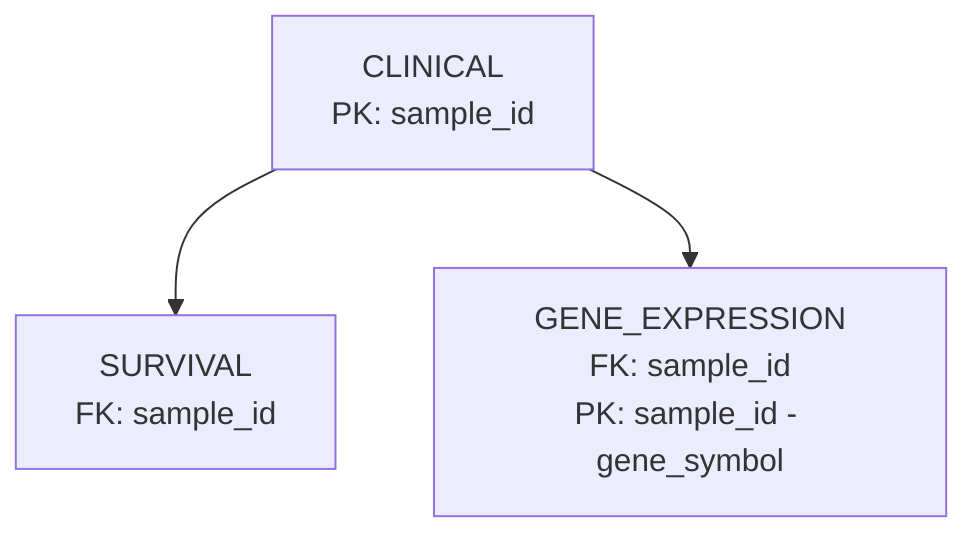

# Oracle APEX Data Integration & REST API Project

## Project Overview

This project demonstrates a complete, end-to-end data engineering pipeline. The primary objective was to take raw, disparate biomedical datasets (clinical, survival, and gene expression), and then clean, transform, and integrate them into a structured relational database hosted on **Oracle APEX**. Finally, the integrated data was exposed to external applications through a secure and well-documented **RESTful API**.

The entire process mirrors a real-world data science workflow, from initial data wrangling with **Python** to database schema design, data loading, and API development.

---

## 1. Data Preparation and Transformation

The foundational phase of the project involved preparing the raw data for database ingestion. This was accomplished using a **Python script with the `pandas` library**. The process addressed several key challenges inherent in the raw data.

### Key Transformation Steps

1.  **Data Subsetting**: The initial analysis revealed that the complete, unpivoted gene expression dataset would be too large for the storage and upload limits of the free Oracle APEX environment. To create a fully functional prototype, the dataset was strategically filtered to include the complete data for the first **6 samples** found in the raw files. This retained the project's structural integrity while ensuring feasibility.

2.  **Column Name Sanitization**: The original column names contained characters incompatible with Oracle SQL standards (e.g., spaces, periods, leading underscores). A cleaning function was implemented to standardize all column names by:

    - Converting them to lowercase.
    - Removing any leading underscores (e.g., `_primary_disease` became `primary_disease`).
    - Replacing all non-alphanumeric characters with an underscore (e.g., `OS.time` became `os_time`).

3.  **Data Type Conversion**: To ensure data integrity and prevent errors during database loading, relevant columns were explicitly converted to their appropriate types. The `pandas.to_numeric` function was used on columns like `age_at_initial_pathologic_diagnosis` and `os_time`, converting any values that couldn't be parsed into `NULL` (`NaN`), which the database handles correctly.
    - Converted these clinical columns to numeric when present: age_at_initial_pathologic_diagnosis, initial_pathologic_dx_year, birth_days_to, death_days_to.
    - Converted survival columns (except sample_id) to numeric.
    - Converted expression values to numeric after melting.

4.  **Normalization (Gene Expression Unpivoting)**: This was the most critical transformation. The `GBM_gene_expression_data.csv` file was in a **"wide" format**, with over 16,000 columns, one for each gene. This structure is extremely inefficient for database querying. The data was "melted" or "unpivoted" into a **"long" format** with three columns: `sample_id`, `gene_symbol`, and `expression_value`. This transformation resulted in a tidy, normalized table structure that is optimal for relational database storage and retrieval.

**Referential integrity**:
Kept only survival and expression rows whose sample_id exists in clinical.

---

## 2. Database Schema Design

A robust relational schema was designed to logically organize the data and enforce integrity using primary and foreign key constraints.

- **`CLINICAL`**: This table serves as the central hub for patient and sample metadata.

  - **Primary Key**: `sample_id`

- **`SURVIVAL`**: This table contains patient survival and outcome data.

  - **Primary Key**: `sample_id`
  - **Foreign Key**: `sample_id` references `CLINICAL(sample_id)`, creating a one-to-one relationship and ensuring that every survival record corresponds to a valid clinical record.

- **`GENE_EXPRESSION`**: This table stores the millions of individual gene expression measurements in the efficient long format.
  - **Composite Primary Key**: `(sample_id, gene_symbol)`. This ensures that there can only be one expression value for a given gene in a specific sample.
  - **Foreign Key**: `sample_id` references `CLINICAL(sample_id)`, creating a one-to-many relationship.

This schema design guarantees **referential integrity** across the entire database.

<!-- Mermaid diagram (preferred) -->


```sql
 -- Table 1: Clinical Data
CREATE TABLE clinical (
    sample_id                           VARCHAR2(50) NOT NULL PRIMARY KEY,
    sample_type_id                      NUMBER,
    sample_type                         VARCHAR2(100),
    primary_disease                     VARCHAR2(100),
    patient                             VARCHAR2(100),
    cancer_type_abbreviation            VARCHAR2(10),
    age_at_initial_pathologic_diagnosis NUMBER,
    gender                              VARCHAR2(10),
    race                                VARCHAR2(50),
    ajcc_pathologic_tumor_stage         VARCHAR2(50),
    clinical_stage                      VARCHAR2(50),
    histological_type                   VARCHAR2(100),
    histological_grade                  VARCHAR2(50),
    initial_pathologic_dx_year          NUMBER,
    menopause_status                    VARCHAR2(50),
    birth_days_to                       NUMBER,
    vital_status                        VARCHAR2(20),
    tumor_status                        VARCHAR2(50),
    last_contact_days_to                NUMBER,
    death_days_to                       NUMBER,
    cause_of_death                      VARCHAR2(100),
    new_tumor_event_type                VARCHAR2(100),
    new_tumor_event_site                VARCHAR2(100),
    new_tumor_event_site_other          VARCHAR2(100),
    new_tumor_event_dx_days_to          NUMBER,
    treatment_outcome_first_course      VARCHAR2(100),
    margin_status                       VARCHAR2(50),
    residual_tumor                      VARCHAR2(50)
);

-- Table 2: Survival Data
CREATE TABLE survival (
    sample_id       VARCHAR2(50) NOT NULL PRIMARY KEY,
    os              NUMBER,
    os_time         NUMBER,
    dss             NUMBER,
    dss_time        NUMBER,
    dfi             NUMBER,
    dfi_time        NUMBER,
    pfi             NUMBER,
    pfi_time        NUMBER,
    redaction       VARCHAR2(50),
    CONSTRAINT fk_survival_sample
        FOREIGN KEY (sample_id)
        REFERENCES clinical(sample_id)
);

-- Table 3: Gene Expression Data
CREATE TABLE gene_expression (
    sample_id         VARCHAR2(50) NOT NULL,
    gene_symbol       VARCHAR2(50) NOT NULL,
    expression_value  NUMBER,
    CONSTRAINT pk_expression PRIMARY KEY (sample_id, gene_symbol),
    CONSTRAINT fk_expression_sample
        FOREIGN KEY (sample_id)
        REFERENCES clinical(sample_id)
);  
```

## 3. API Endpoint Documentation

A RESTful API was created using **Oracle APEX RESTful Services** to provide programmatic access to the data.

**Base URL**: `https://oracleapex.com/ords/your_schema/api/v1/`

---

#### `GET /clinical`

Returns all clinical metadata for the samples loaded in the database.

- **URL**: `/clinical`
- **Method**: `GET`

```json
{
  "items": [
    {
      "sample_id": "TCGA-32-2632-01",
      "sample_type_id": 1,
      "sample_type": "Primary Tumor",
      "primary_disease": "glioblastoma multiforme",
      "patient": "TCGA-32-2632",
      "cancer_type_abbreviation": "GBM",
      "age_at_initial_pathologic_diagnosis": 80,
      "gender": "MALE",
      "race": "WHITE",
      "ajcc_pathologic_tumor_stage": null,
      "clinical_stage": null,
      "histological_type": "Untreated primary (de novo) GBM",
      "histological_grade": null,
      "initial_pathologic_dx_year": 2008,
      "menopause_status": null,
      "birth_days_to": -29281,
      "vital_status": "Dead",
      "tumor_status": "WITH TUMOR",
      "last_contact_days_to": null,
      "death_days_to": 269,
      "cause_of_death": null,
      "new_tumor_event_type": null,
      "new_tumor_event_site": null,
      "new_tumor_event_site_other": null,
      "new_tumor_event_dx_days_to": null,
      "treatment_outcome_first_course": "Progressive Disease",
      "margin_status": null,
      "residual_tumor": null
    }, 
    ...
  ]
}
```

---

#### `GET /expression/{gene_symbol}`

Returns all expression values for a given gene symbol across all available samples.

- **URL**: `/expression/{gene_symbol}`
- **Method**: `GET`
- **URL Parameters**:
  - `gene_symbol` (string, required): The official gene symbol to query (e.g., `tp53`). Note that gene symbols are stored in lowercase.

 ```json
 {
  "items": [
    {
      "sample_id": "TCGA-06-5412-01",
      "expression_value": 9.2027
    },
    {
      "sample_id": "TCGA-12-5299-01",
      "expression_value": 10.1554
    },
    {
      "sample_id": "TCGA-06-2565-01",
      "expression_value": 10.7435
    }
  ],
  "hasMore": false,
  "limit": 25,
  "offset": 0,
  "count": 3,
  "links": [
    {
      "rel": "self",
      "href": "https://oracleapex.com/ords/data_integration_rest_api/api/expression/arhgef10l"
    },
    {
      "rel": "describedby",
      "href": "https://oracleapex.com/ords/data_integration_rest_api/metadata-catalog/api/expression/item"
    },
    {
      "rel": "first",
      "href": "https://oracleapex.com/ords/data_integration_rest_api/api/expression/arhgef10l"
    }
  ]
}
 ``` 

---

#### `GET /survival/{sample_id}`

Returns detailed survival and outcome information for a single, specified sample.

- **URL**: `/survival/{sample_id}`
- **Method**: `GET`
- **URL Parameters**:
  - `sample_id` (string, required): The unique sample identifier (e.g., `TCGA-06-5412-01`).

```json
{
  "items": [
    {
      "sample_id": "TCGA-06-2565-01",
      "os": 1,
      "os_time": 506,
      "dss": 1,
      "dss_time": 506,
      "dfi": null,
      "dfi_time": null,
      "pfi": 1,
      "pfi_time": 178,
      "redaction": null
    }
  ],
  "hasMore": false,
  "limit": 25,
  "offset": 0,
  "count": 1,
  "links": [
    {
      "rel": "self",
      "href": "https://oracleapex.com/ords/data_integration_rest_api/api/survival/TCGA-06-2565-01"
    },
    {
      "rel": "describedby",
      "href": "https://oracleapex.com/ords/data_integration_rest_api/metadata-catalog/api/survival/item"
    },
    {
      "rel": "first",
      "href": "https://oracleapex.com/ords/data_integration_rest_api/api/survival/TCGA-06-2565-01"
    }
  ]
}
```

---

#### `GET /patient/{sample_id}` (Bonus Endpoint)

Returns a concise, merged summary of clinical, survival, and a _count_ of gene expression records for a single patient.

- **URL**: `/patient/{sample_id}`
- **Method**: `GET`
- **URL Parameters**:
  - `sample_id` (string, required): The sample ID to query.

```json
{
  "items": [
    {
      "sample_id": "TCGA-06-2565-01",
      "age_at_initial_pathologic_diagnosis": 59,
      "gender": "MALE",
      "ajcc_pathologic_tumor_stage": null,
      "primary_disease": "glioblastoma multiforme",
      "os": 1,
      "os_time": 506,
      "gene_expression_record_count": 16383
    }
  ],
  "hasMore": false,
  "limit": 25,
  "offset": 0,
  "count": 1,
  "links": [
    {
      "rel": "self",
      "href": "https://oracleapex.com/ords/data_integration_rest_api/api/patient/TCGA-06-2565-01"
    },
    {
      "rel": "describedby",
      "href": "https://oracleapex.com/ords/data_integration_rest_api/metadata-catalog/api/patient/item"
    },
    {
      "rel": "first",
      "href": "https://oracleapex.com/ords/data_integration_rest_api/api/patient/TCGA-06-2565-01"
    }
  ]
}
```

---

#### `GET /patient-full/{sample_id}` (Bonus Endpoint)

Returns a comprehensive, nested JSON object for a single patient, including all of their individual gene expression records.

- **URL**: `/patient-full/{sample_id}`
- **Method**: `GET`
- **URL Parameters**:
  - `sample_id` (string, required): The sample ID to query.

---

## 4. Challenges, Solutions, and Future Improvements

- **Challenge**: The primary obstacle was the **storage and upload limitations** of the free Oracle APEX environment. The fully transformed gene expression file was several hundred megabytes, leading to `413 Request Entity Too Large` errors on upload and `ORA-01536: space quota exceeded` errors when loading data.
- **Solution**: An adaptive, iterative approach was taken. The initial strategy of uploading a single large file failed. The next attempt to split the file into smaller chunks also failed due to the database storage quota. The final, successful strategy was to **reduce the scope of the data** to a small but complete subset of 6 samples. This allowed the entire pipeline to be built and demonstrated effectively.

- **Future Improvements**:
  1.  **Performance Optimization**: In a production environment with the full dataset, query performance would be critical. **Database indexes** should be created on the `gene_expression(gene_symbol)` column and all foreign key columns (`sample_id`) to accelerate API response times for joins and lookups.
  2.  **Scalable API Design**: The `/patient-full` endpoint, while functional, is not scalable as it returns a massive JSON payload. A better production design would be to implement **pagination** on a dedicated expression endpoint (e.g., `/expression/by-sample/{sample_id}?page=1&limit=100`) to allow clients to retrieve large result sets in manageable chunks.

  
